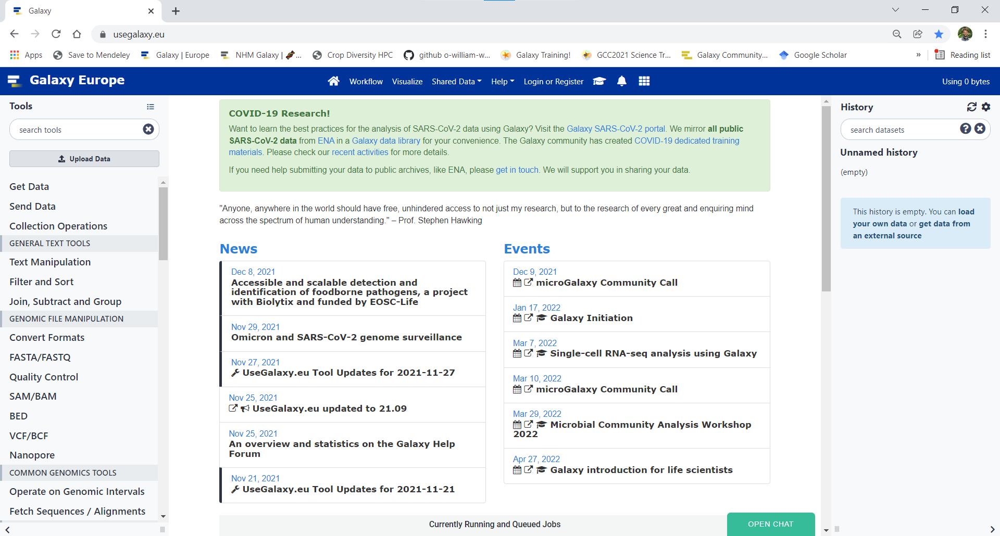
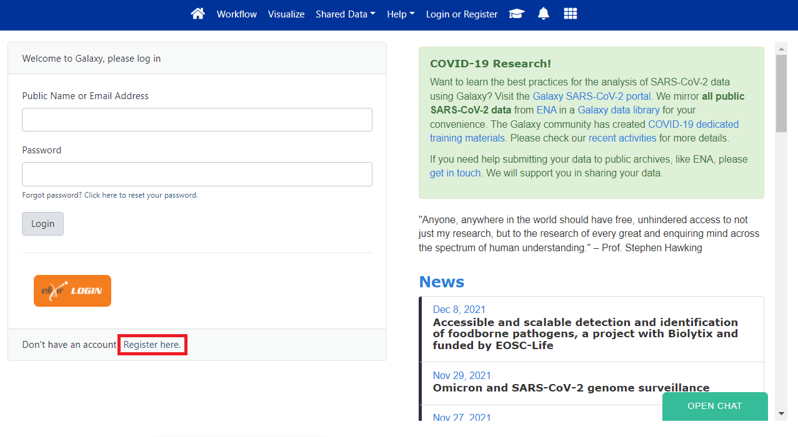
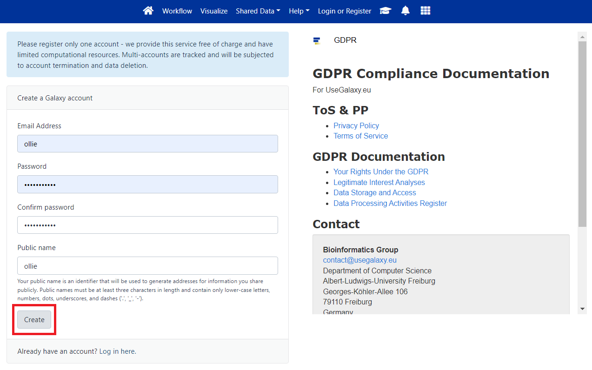
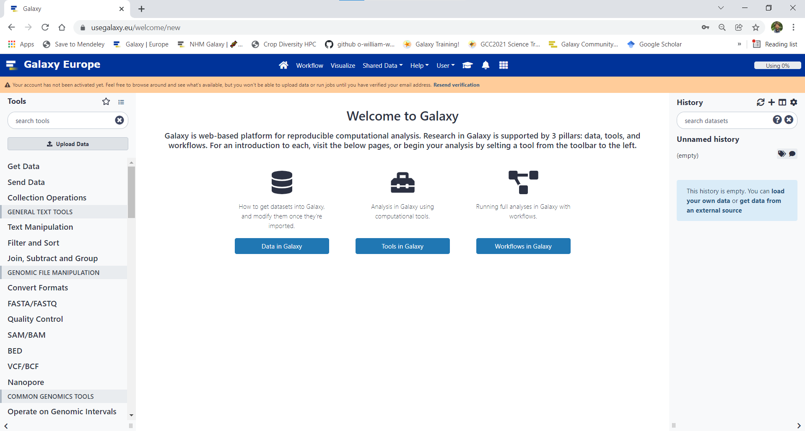
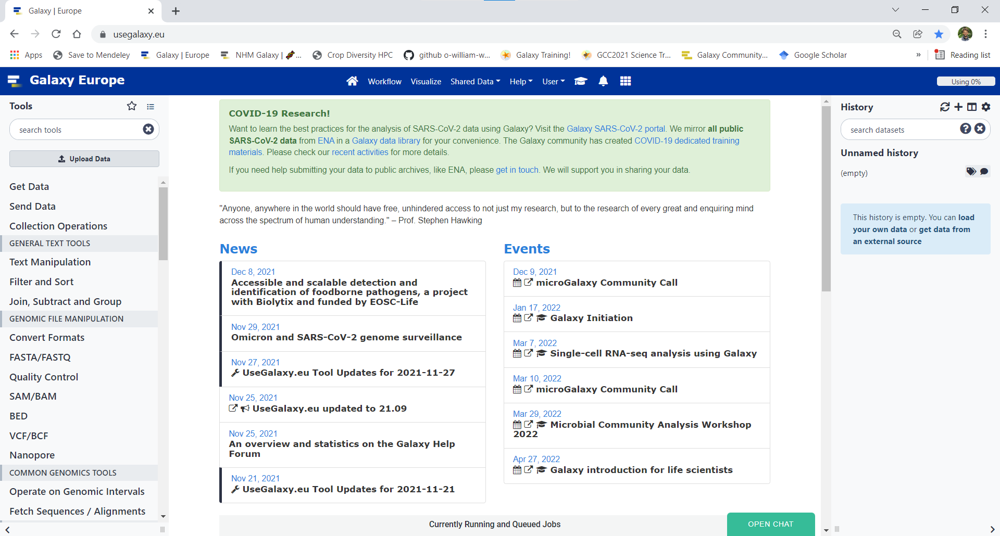

### Create account for the European Galaxy server
Open a web browser such as [Google](https://www.google.com/)  
Go to https://usegalaxy.eu/  
The page should look something like this:  

If you are a new user and/or are not logged in, the top menu bar will have a button for "Login or Register". **Select "Login or "Register".**  

 
If you have not already got an account, **select "Register here".** 
  
  
**Register with an email, password and username and select "Create".**
  
  
You should then see a window that looks like this
  
  
However, you won't be able to use Galaxy until you **verify your email address**. Check you emails and select the link to verify your account. Once you have done this you can return to Galaxy. The Galaxy page should look like this:
  
Note that the menu bar has now changed, there is now a "User" option
    
You are now logged in the Galaxy server and ready to get started!
