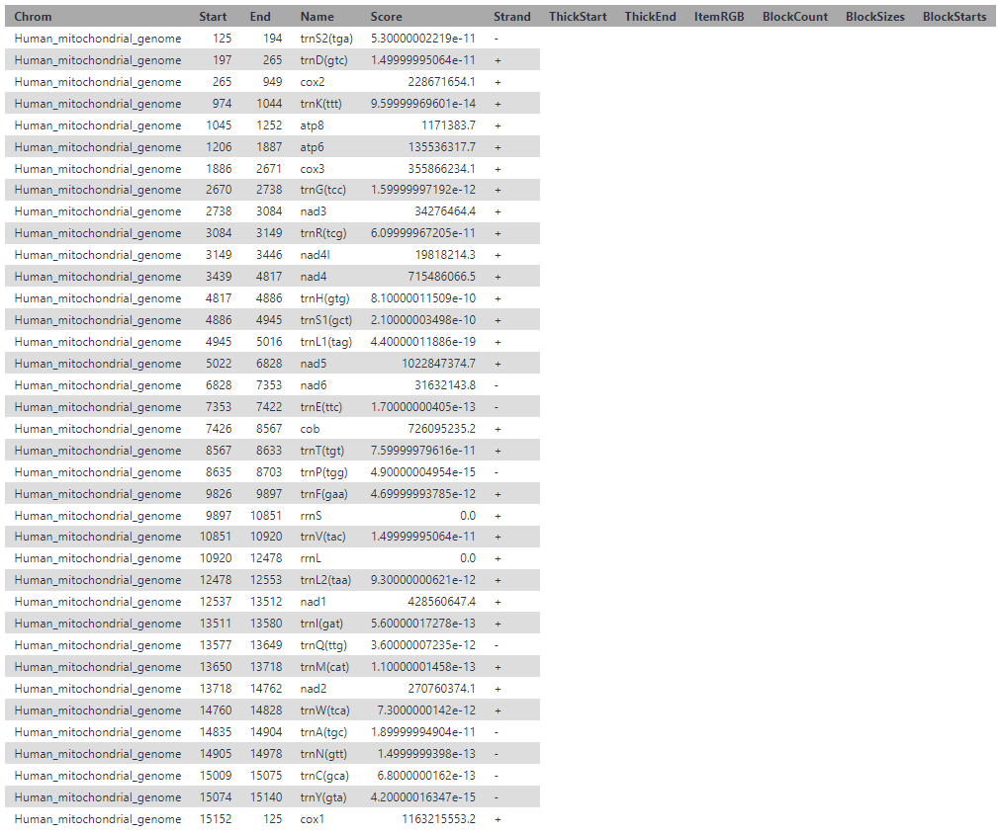

# Mitochondrial genome assembly and annotation

## Overview
In this tutorial we will assemble the human mitochondrial genome, annotate genes and visualise the annotations. For simplicity and assembly speed, we will use the example data provided with Novoplasty.

In this tutorial we will:
 - [Import the data into Galaxy](#import-the-data-into-galaxy)  
 - [Assemble the mitochondrial genome using Novoplasty](#assemble-the-mitochondrial-genome-using-novoplasty)
 - [Annotate the mitochondrial genome using MITOS](#annotate-the-mitochondrial-genome-using-mitos)
 - [Edit annotations for visualisation of a circular genome](#edit-annotations-for-visualisation-of-a-circular-genome)
 - [Visualise the annotations with CIRCOS](#visualise-the-annotations-with-circos)
 - [Annotate any mitochondrial genome using a workflow](#annotate-any-mitochondrial-genome-using-a-workflow)


## Import the data into Galaxy

### 1. Make sure you have an empty analysis history and give it a name.
Click the + icon at the top of the history panel.
Select 'Unamed history' and give it a name e.g. "Mitochondrial genome assembly"


### 2. Import sample data and reference data
Import the example data for mitochondrial genome assembly from Novoplasty. For more information on Novoplasty, please see the [Novoplasty github page](https://github.com/ndierckx/NOVOPlasty).

The input data consists of three fasta files, two consisting of forward and reverse sequencing reads, and another fasta file with a mitochondrial gene to act as a seed sequence for genome assembly.

To upload the data:
* Copy the URLs below  
* Open the Galaxy Upload Manager ('Upload data' bottun on the top of the tool panel)  
* Select 'Paste/Fetch Data'
* Paste the URLs into the text field
* Press Start
* Close the window
```
https://github.com/ndierckx/NOVOPlasty/raw/master/Test%20datasets/Mitochondrial%20assembly/Homo_sapiens_R1.fasta.gz
https://github.com/ndierckx/NOVOPlasty/raw/master/Test%20datasets/Mitochondrial%20assembly/Homo_sapiens_R2.fasta.gz
https://github.com/ndierckx/NOVOPlasty/raw/master/Test%20datasets/Mitochondrial%20assembly/Seed_mito.fasta
```

## Assemble the mitochondrial genome using Novoplasty

Now we have the input data, we can assemble the mitochondrial genome using Novoplasty. 

Select "Novoplasty" from the tool panel
Set the following paramters
* Select read file type: Separate reads
* Select file with forward reads: Homo_sapiens_R1.fasta.gz
* Select file with reverse reads: Homo_sapiens_R2.fasta.gz
* Select file with seed sequence: Seed_mito.fasta
* Assembly type: Mitochondrial assembly
* Leave all other parameters as default

This analysis can take a little bit of time, so now is a good time for a tea break!

Novoplasty will generate several output files for the different potential assembly outputs including: circularized assembly, uncircularized assembly, assembly option 1 or 2 (this is related to chloroplast assemblies which often have two possible orientations of repeat regions), merged contigs and contigs.

Have a look through the assembly outputs. **Note that your results may be slighty different to those shown in this tutorial**. Galaxy produces all potential outputs by default but this does not mean they are all relevant to the analysis. Indeed, some of the outputs are empty.

Our output has produced a "Circularized assembly". Have a closer look at the assembled sequence using the eye icon of the dataset in the History panel. It should look like this:


Because our output was a cicularised, the uncircularized assembly output was empty. Likewise assembly option 1 and 2 are empty because we we not assembling the chloroplast genome which can have different orientations. The merged contigs and contigs outputs are also empty. For tidyness we can now delete the outputs for uncircularized assembly, assembly option 1 or 2 merged contigs and contigs.

 Novoplasty will have different outputs depending of the quality of the input data. **We have to be careful when using tools like this in workflows becuase we do not know what the output will be**. 

 At the moment our circularized assembly is simply called "Contig1". Lets rename it to something more relevant.

Select "Replace parts of text" from the tool panel  
Set the following paramters
* Find pattern: ">Contig1"
* Replace with: ">Human_mitochondrial_genome" (**Note no whitespaces in name**)
* Leave all other parameters as default
 
When the replace tool completes, we can also rename the result in our history to something more relevant. Edit the name by selecting the pencil icon of the dataset in the history panel. Change the name to "Human mitochondrial genome" and select save.

Our output should now look like this:


At this point we might want to investigate our mitochondrial assembly in more detail. For example, lets have a look at our assembly length using the "Compute sequence length" tool. 

Select "Compute sequence length" from the tool panel
Set the following paramters
* Compute length for these sequences: "Human mitochondrial genome"
* Leave all other parameters as default

Check the output in the history panel. It should say the sequence length is 16569 or similar. Your assembly may be slightly different.


## Annotate the mitochondrial genome using MITOS

We will now annotate our circularized assembly using MITOS2

Select "MITOS2" from the tool panel
Set the following paramters
* Sequence: Human mitochondrial genome
* Leave all other parameters as default

MITOS will produce a single BED file, specifying the location of annotated genes in the circularized assembly. It should look like the BED output below where the columns refer to the sequence name, start position of the gene, end postion of the gene, gene name, score and orientation. 



## Edit annotations for visulisation of a circular genome

Although our Human mitochondrial genome is a circular assembly, a fasta file can only represent a linear sequence with a breakpoint somewhere along the assembly. As a result, there may be a situation where a mitochrondrial gene annotation spans the break point. 

For example, see the last line of the BED file above where the cox1 gene spans the breakpoint in the fasta file. You can see this becuse the the start position (15152) is greater than the end position (125): 

```
Human_mitochondrial_genome	15152	125	    cox1	    1163215553.2	    +
```

Later on we want to annotate our genome using CIRCOS. However, we cannot annotate a gene that spans a breakpoint using CIRCOS. Therefore, we need to edit our BED file to have two lines which look like this:
```
Human_mitochondrial_genome	15152	16569   cox1	    1163215553.2	    +
Human_mitochondrial_genome	0    	125	    cox1	    1163215553.2	    +
```

If there are no annotations in your BED file that span the breakpoint in your fasta sequence,  you can move on to [Visualise the annotations with CIRCOS](#visualise-the-annotations-with-circos).

To edit the BED file as described above, carry out the following steps. 

First of all we will reformat our BED file to a text file. This will also reomve some of the column headings from MITOS2 which are unecessary.

Select "Table Compute" from the tools panel
Set the following paramters:
* Table: MITOS2 output
* Unselect column and row names option for input data
* Type of operation: No operation (just reformat an output)
* Unselect column and row names option for output data

Next we want to identify rows where the start position (column 2) is larger than the end position (column 3). 

Select "Compute an expression on every row" from the tool panel. 
Set the following paramters:
* Add expression: c2 > c3
* As new column to: Table Compute output
* Leave all other parameters as default

This will create a tabular output with a new column of TRUE or FALSE values like this:


 Let's split this table into two tables, one with True values and the other with False. 

Select "Search in textfiles" from the tool panel.
Set the following paramters:
* Select lines from:  Compute output
* Regular expression: True
* Leave all other parameters as default

Rename this output "Split annotations"

Repeat "Search in textfiles" as above but with a regular expression "False". Rename this output "Remaining annotations"

Now we will edit start and end positions in "Split annotations"

Select "Replace text on a specific column" from the tool panel.
Set the following paramters:
* File to process: Split annotations
* In column: 2
* Find pattern: [0-9]*
* Replace with: 0

This will replace all values in column two with a 0. Rename this output "Split annotations A"

Select "Replace text on a specific column" from the tool panel again.
Set the following paramters:
* File to process: Split annotations
* In column: 3
* Find pattern: [0-9]*
* Replace with: 16569

This will replace all values in column 3 with 16569, the sequence length of our assembly. Rename this output "Split annotations B"

Now we will concatenate the three text files "Remaining annotations", "Split annotations A" and "Split annotations B". 

Select "Concatenate datasets tail-to-head" from the tool panel again.
Set the following paramters:
* Datasets to concatenate (hold Ctrl key to select multple datasets at once): 
    * Remaining annotations
    * Split annotations A
    * Split annotations B

We don't want the column of True/False values anymore so we can remove this using Cut

Select "Cut columns from a table" from the tool panel again.
Set the following paramters:
* Cut columns: c1-c6 
* From: Concatenate output

Rename this output "Reformtted BED". We also need to change the datatype from "tabular" to "BED" so the data will be recofgnised by CIRCOS. 

To change the datatype of Reformtted BED:
* Select the pencil icon of the dataset
* Select the dataset tab
* Select BED from new type


## Visualise the annotations with CIRCOS

To plot the positions and labels of our genes, we need to reformat our BED file. 

Select "Circos: Interval to Tiles" from the tool panel again.
Set the following paramters:
* BED file: Reformatted BED

Select "Circos: Interval to Circos Text Labels" from the tool panel.
Set the following paramters:
* BED file: Reformatted BED

We are now ready to plot the annotation!

Select "Circos visualizes data in a circular layout" from the tool panel.
Set the following paramters:
* Reference Genome Source: Fasta file
* Source fasta file: Human mitochondrial genome
* Open "Ideogram" options
    * Chromosome units: Kilobases
    * Spacing Between Ideograms: 0
* Open "2D Data Tracks" options
    * Insert 2D Data Plot
        * Outside Radius: 0.9
        * Inside Radius: 0.88
        * Plot type: Tiles
        * Tile data source: Interval to Tiles output
    * Insert 2D Data Plot
        * Outside Radius: 0.87
        * Inside Radius: 0.8
        * Plot type: Text labels
        * Tile data source: Interval to Circos Test labels output
        * Plot format specific options
            * Show link: No
* Open "Ticks" options
    * Insert Tick group
        * Show tick labels: Yes

The plot should look somethink like this


## Annotate any mitochondrial genome using a workflow

We can use the analysis above to build a workflow that can assemble any circular mitochondrial genome assembly. I have created a workflow accessible with this link: 
```
https://usegalaxy.eu/u/ollie_white/w/mitos-annotation-and-circos-plot
```

The work flow looks like this in the Galaxy workflow editor:


Let's run the workflow using a mitochondrial genome assembly for a [mouse](#https://www.ncbi.nlm.nih.gov/nuccore/NC_005089.1). However, this pipeline *should* work for any circular mitochondrial genome assembly.  

Create a new history as above and the assembled dataset directly from NCBI using efetch. 

Select "NCBI EFetch" from the tool panel.
Set the following paramters:
* NCBI Database to Use: Nucleotide
* Output Format: Fasta
* Select source for IDs: Direct Entry
* ID List: NC_005089.1

The output of EFetch is a list with one item. Lets extract the fasta file we need. 

Select "Extract dataset" from the tool panel.
Set the following paramters:
* Input List: NCBI EFetch results
* How should a dataset be selected?: The first dataset

Once this has finished, rename the output of extract dataset to something more meaningful e.g. "Mouse mitochondrial genome"

The output should be a fasta file that looks like this:


Open a new browser and go to:
```
https://usegalaxy.eu/u/ollie_white/w/mitos-annotation-and-circos-plot
```

Select "Run workflow"


Enter the following paramters:
* Input circular mitochondrial assembly: Mouse mitochondrial genome
* Genetic code (MITOS2): Vertebrate (2)
* Reference data MITOS2): RefSeq63 Metzoa
* Select "Run Workflow"


Once complete, there should be four additional datasets in your history for MITOS2, MITOS reformated, Circos Plot and Circos Karyotype. 

Download and open the Circos plot, it should look like this:


