# DADA2 tutorial

## Overview
In this tutorial we will use a workflow to analyse 16S rRNA sequencing data using the R package DADA2 in Galaxy, following the same steps as the [DADA2 tutorial](https://benjjneb.github.io/dada2/tutorial.html). We will use MiSeq Standard Operating Procedure (SOP) developed for the Mothur software package.

In this tutorial we will:
 - [Import the data into Galaxy](#import-the-data-into-galaxy)
 - [Organise data into paired collection](#organise-data-into-paired-collection)  
 - [Plot read quality profiles](#plot-read-quality-profiles) 
 - [Import the Galaxy workflow](#import-the-galaxy-workflow)
 - [Run the Galaxy workflow](#run-the-galaxy-workflow)

## Import the data into Galaxy

### Make sure you have an empty analysis history and give it a name.
Click the + icon at the top of the history panel.
Select 'Unamed hisotry' and give it a name e.g. DADA2 workflow


### Import sample data and reference data
Import the sample FASTQ files and reference data to your history from Zenodo 
 - Copy the URLs below  
 - Open the Galaxy Upload Manager (Select 'Upload data' at the top of the tool panel)  
 - Select 'Paste/Fetch Data'  
 - Paste the URLs into the text field  
 - Press Start  
 - Close the window  

```
https://zenodo.org/record/800651/files/F3D0_R1.fastq
https://zenodo.org/record/800651/files/F3D0_R2.fastq
https://zenodo.org/record/800651/files/F3D141_R1.fastq
https://zenodo.org/record/800651/files/F3D141_R2.fastq
https://zenodo.org/record/800651/files/F3D142_R1.fastq
https://zenodo.org/record/800651/files/F3D142_R2.fastq
https://zenodo.org/record/800651/files/F3D143_R1.fastq
https://zenodo.org/record/800651/files/F3D143_R2.fastq
https://zenodo.org/record/800651/files/F3D144_R1.fastq
https://zenodo.org/record/800651/files/F3D144_R2.fastq
https://zenodo.org/record/800651/files/F3D145_R1.fastq
https://zenodo.org/record/800651/files/F3D145_R2.fastq
https://zenodo.org/record/800651/files/F3D146_R1.fastq
https://zenodo.org/record/800651/files/F3D146_R2.fastq
https://zenodo.org/record/800651/files/F3D147_R1.fastq
https://zenodo.org/record/800651/files/F3D147_R2.fastq
https://zenodo.org/record/800651/files/F3D148_R1.fastq
https://zenodo.org/record/800651/files/F3D148_R2.fastq
https://zenodo.org/record/800651/files/F3D149_R1.fastq
https://zenodo.org/record/800651/files/F3D149_R2.fastq
https://zenodo.org/record/800651/files/F3D150_R1.fastq
https://zenodo.org/record/800651/files/F3D150_R2.fastq
https://zenodo.org/record/800651/files/F3D1_R1.fastq
https://zenodo.org/record/800651/files/F3D1_R2.fastq
https://zenodo.org/record/800651/files/F3D2_R1.fastq
https://zenodo.org/record/800651/files/F3D2_R2.fastq
https://zenodo.org/record/800651/files/F3D3_R1.fastq
https://zenodo.org/record/800651/files/F3D3_R2.fastq
https://zenodo.org/record/800651/files/F3D5_R1.fastq
https://zenodo.org/record/800651/files/F3D5_R2.fastq
https://zenodo.org/record/800651/files/F3D6_R1.fastq
https://zenodo.org/record/800651/files/F3D6_R2.fastq
https://zenodo.org/record/800651/files/F3D7_R1.fastq
https://zenodo.org/record/800651/files/F3D7_R2.fastq
https://zenodo.org/record/800651/files/F3D8_R1.fastq
https://zenodo.org/record/800651/files/F3D8_R2.fastq
https://zenodo.org/record/800651/files/F3D9_R1.fastq
https://zenodo.org/record/800651/files/F3D9_R2.fastq
https://zenodo.org/record/800651/files/Mock_R1.fastq
https://zenodo.org/record/800651/files/Mock_R2.fastq
https://zenodo.org/record/4587955/files/silva_nr99_v138.1_train_set.fa.gz
```
## Organise data into paired collection

There are a lot of files in the history now but Galaxy can organise our files into collections to make it more managable. Since we have paired-end data, each sample consists of two separate fastq files, one containing the forward reads, and one containing the reverse reads. We can recognise the pairing from the file names, which will differ only by _R1 or _R2 in the filename. We can tell Galaxy about this paired naming convention, so that our tools will know which files belong together. We do this by building a "List of Dataset Pairs".

Click on the tick icon at top of your history.
Select all the FASTQ files (40 in total). Tip: Type 'fastq' in the search bar at the top of your history to filter only the FASTQ files; you can now use the 'All' button at the top instead of having to individually select all 40 input files.
Click on 'For all selected..'
Select 'Build List of Dataset Pairs' from the dropdown menu
In the next dialog window you can create the list of pairs. By default Galaxy will look for pairs of files that differ only by a _1 and _2 part in their names. In our case however, these should be _R1 and _R2.
Change these values accordingly
Change _1 to _R1 in the text field on the top left
Change _2 to _R2 om the text field on the top right
You should now see a list of pairs suggested by Galaxy:

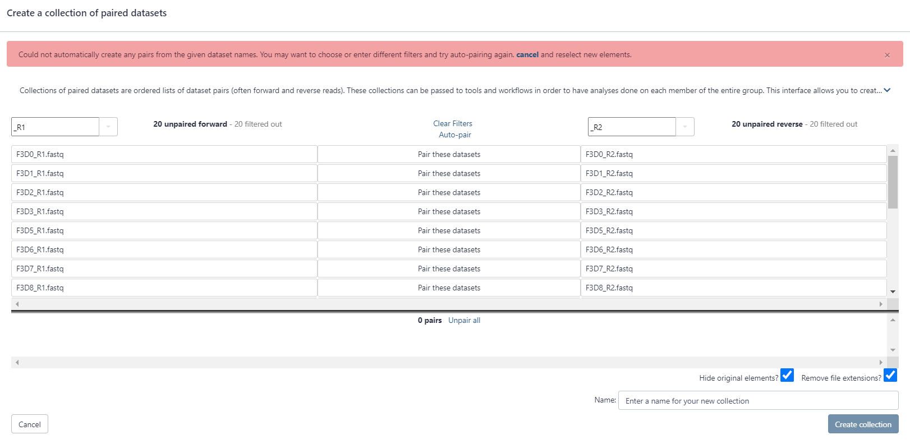

Click on auto-pair to create the suggested pairs.

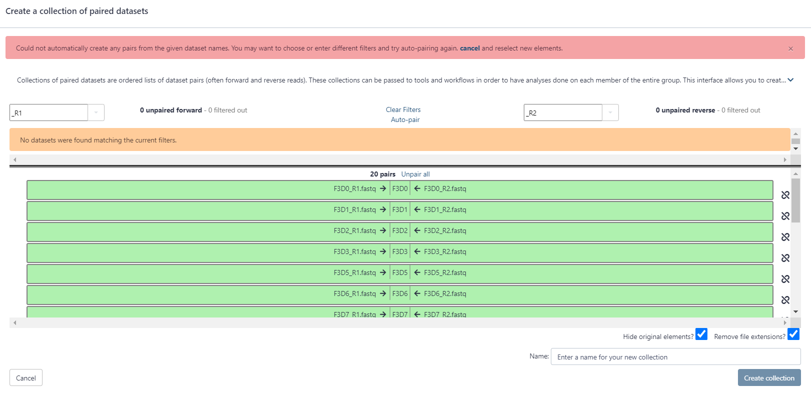

The middle segment is the name for each pair. These names will be used as sample names in the downstream analysis, so always make sure they are informative! Check that the pairs are named F3D0-F3D9, F3D141-F3D150 and Mock.
If needed, the names can be edited by clicking on them
Name your collection at the bottom right of the screen, for e.g. 'SOP data'.  

Click the 'Create List' button. A new dataset collection item will now appear in your history


## Plot read quality profiles

Now we have the data in galaxy, we can visulaise the quality profiles of the forward reads and reverse reads.

The 'dada2: plotQualityProfile' tool will allow us to do this.

Select 'dada2: plotQualityProfile' from the tool panel and set the following paramters:  
 - 'Processing mode': batch
 - 'Paired reads': paired - in a data set pair  
 - 'Paired short read data': SOP data (or whatever name you gave the collection)

Once complete, there will be two collections of plots in your galaxy history. One for the forward reads and another for the reverse. We can view the quality profiles using the 'eye' icon. Below are quality profiles for the forward and reverse reads of sample F3D0.

In gray-scale is a heat map of the frequency of each quality score at each base position. The mean quality score at each position is shown by the green line, and the quartiles of the quality score distribution by the orange lines. The red line shows the scaled proportion of reads that extend to at least that position (this is more useful for other sequencing technologies, as Illumina reads are typically all the same length, hence the flat red line).

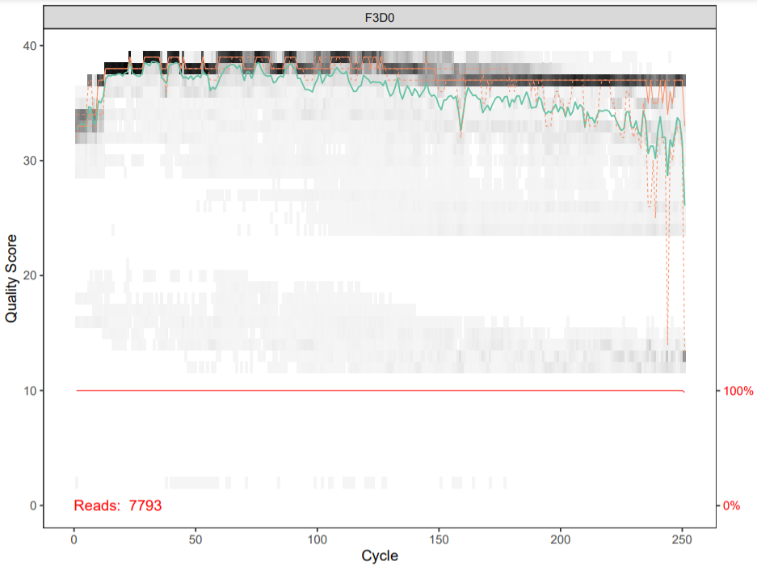

The forward reads are good quality. We generally advise trimming the last few nucleotides to avoid less well-controlled errors that can arise there. These quality profiles do not suggest that any additional trimming is needed. 

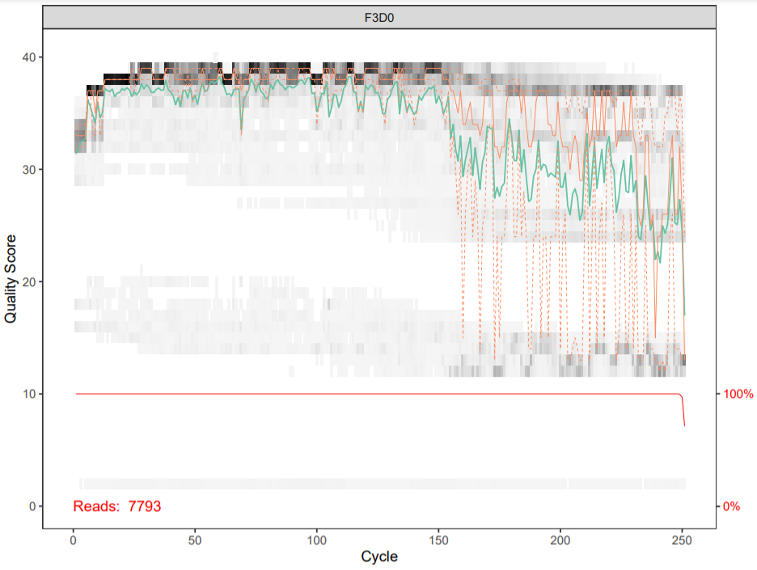

The reverse reads are of significantly worse quality, especially at the end, which is common in Illumina sequencing. This isn’t too worrisome, as DADA2 incorporates quality information into its error model which makes the algorithm robust to lower quality sequence, but trimming as the average qualities crash will improve the algorithm’s sensitivity to rare sequence variants. 

## Import the Galaxy workflow
 
Below is a schematic with the main steps in the DADA2 workflow that we will implement.  

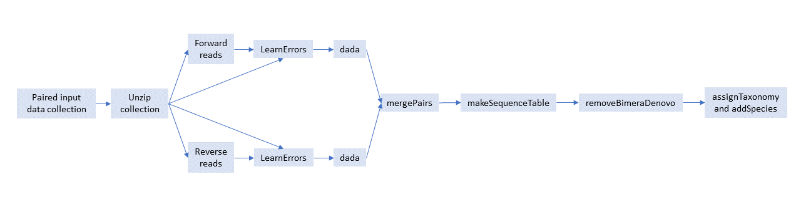

Select "Workflow" from the top menu bar of Galaxy. You will see a list of all your workflows.

Click on the upload icon at the top-right of the screen.

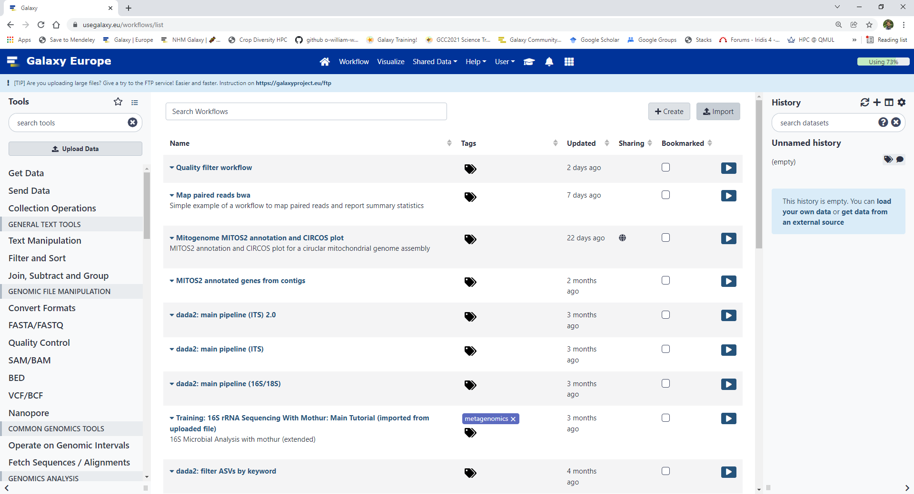

Copy the address of the following URL:

```
https://usegalaxy.eu/u/ollie_white/w/dada2-16s-workflow/json
```
Paste the URL of the workflow into the box labelled “Archived Workflow URL” and select import workflow.

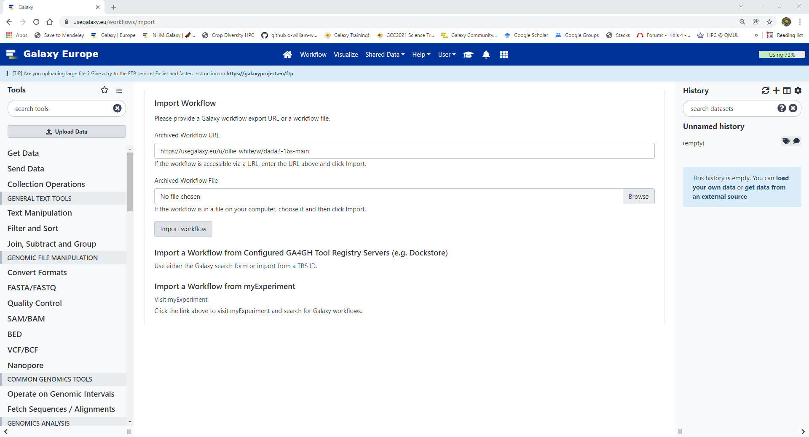

This will take you back to the workflow menu and there should now be a new workflow at the top of the list, called something like "dada2: main pipeline (16S/18S)".

To look at the workflow, select the workflow name and edit from the list of drop down options.

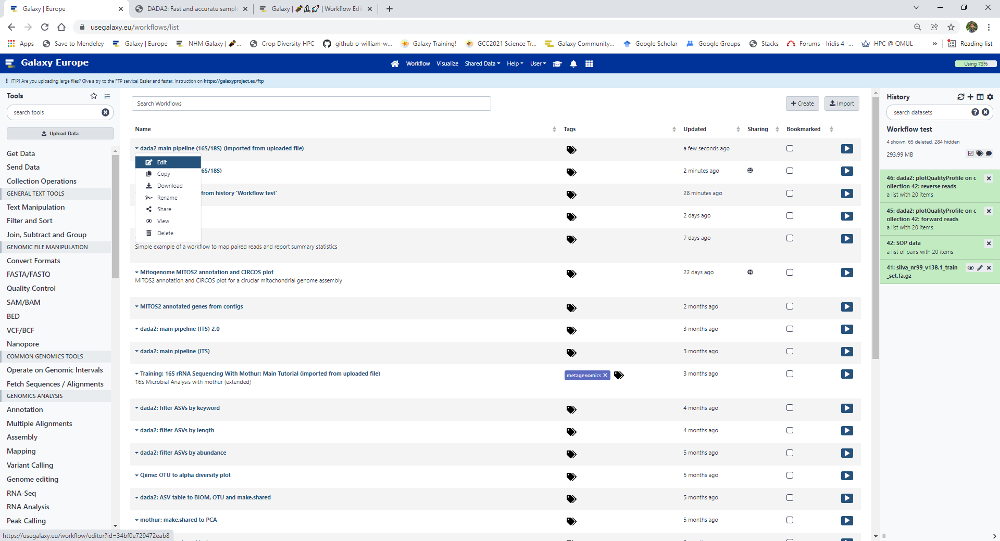

This will open the workflow editor which should look something like this. 

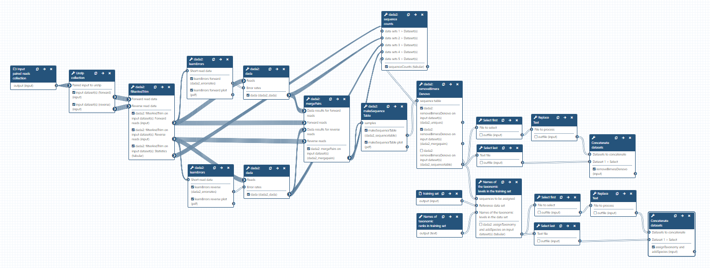

## Run the Galaxy workflow

To run the workflow select the run workflow option from the top right hand corner of the workflow editor.

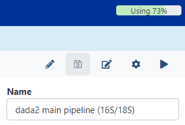

Or select run worflow option from the main workflow window

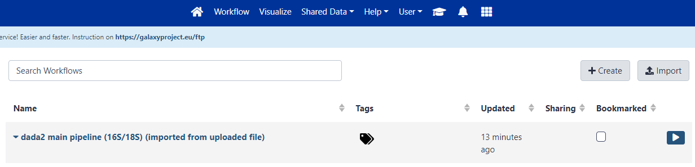

This will bring up a window where we can set the input data for out workflow. 

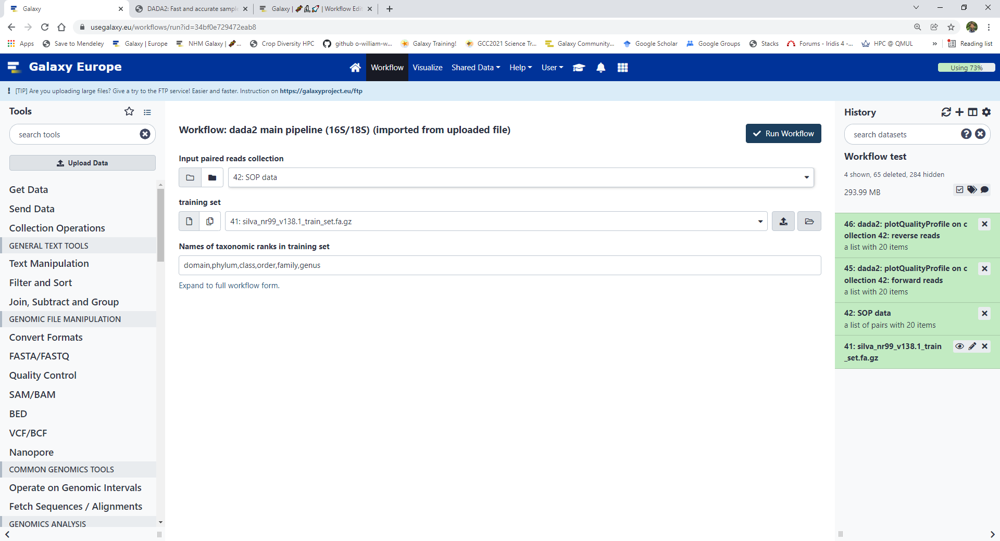


Select the follwing options:  
 - 'Input paired reads collection': SOP data (or whatever name you gave the collection)  
 - 'Training set': silva_nr99_v138.1_wSpecies_train_set.fa.gz  
 - 'Names of taxonomic ranks in training set': domain,phylum,class,order,family,genus

Once you have entered the inut data, select "Run workflow"

It can take some time to run all of the steps in this workflow so now is a good time to take a break :)

