# Using interactive environments in Galaxy

This tutorial shows how to create interactive plots in Rstudio and Jupyter notebooks and save the output to Galaxy. 

Download Iris dataset from zenodo
```
https://zenodo.org/record/1319069/files/iris.csv
```

## Rstudio

Select Rstudio from tool panel tool and select "Execute"

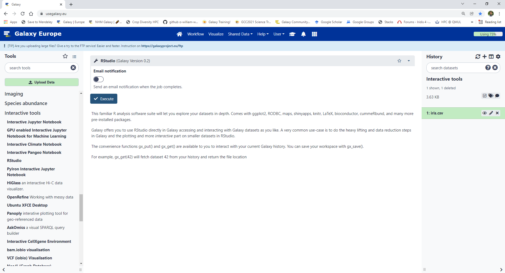

When Rstudio option turns amber/orange in the history panel, select "User" from the top menu and "Active Interactive Tools"

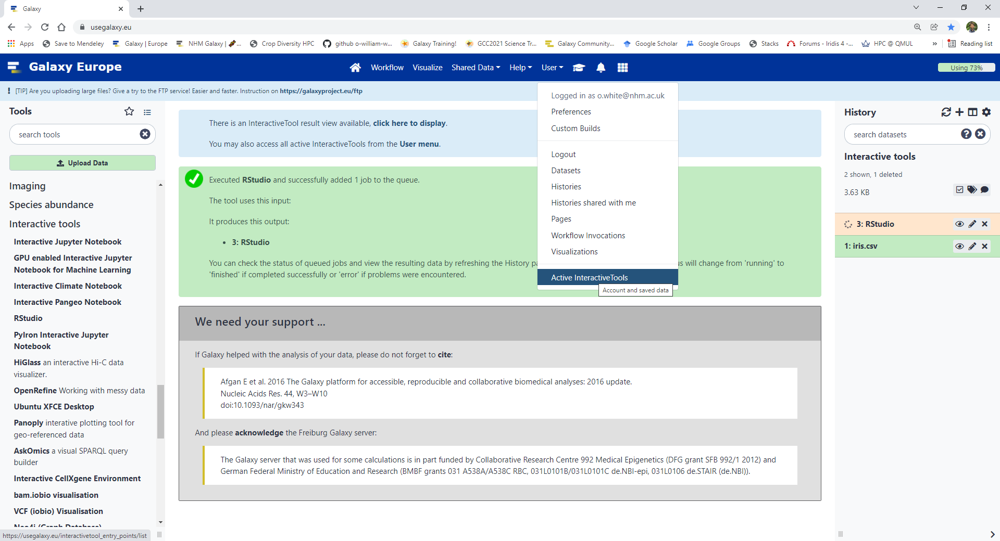

Select Rstudio under the Name column. 

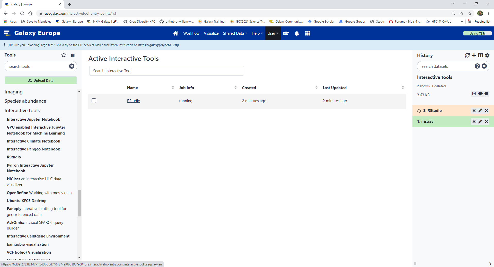

This will open a new window with Rstudio

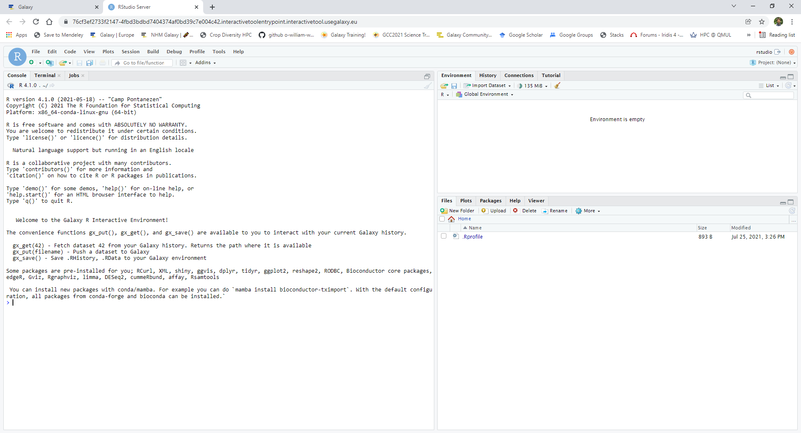

We can now open a new script by selecting "File", "New File" and "R script".

Save the R script as plot_iris.R and run the following code. 

```
library(ggplot2)

# read csv from galaxy
dat <- read.csv(gx_get(1))

# create plot
p <- ggplot(data = dat, aes(x=Sepal.Length, y=Sepal.Width, colour=Species)) + geom_point()

# save png
png("example_plot.png")
p
dev.off()

# push png to galaxy
gx_put("example_plot.png")
gx_put("plot_iris.R")

# save RHistory, .RData to your Galaxy environment
gx_save()
```
You Rstudio window might look something like this:

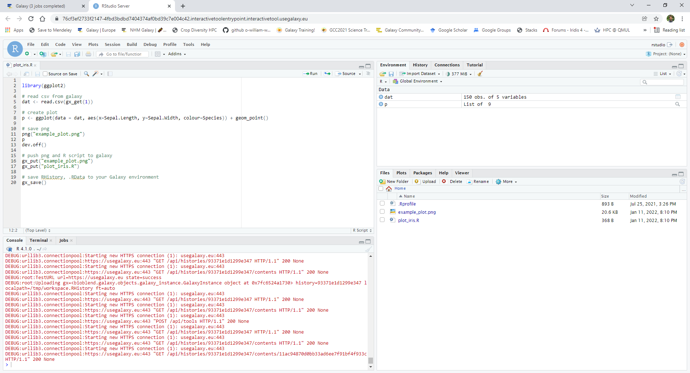

If you go back to Galaxy you can see the outputs in the history panel

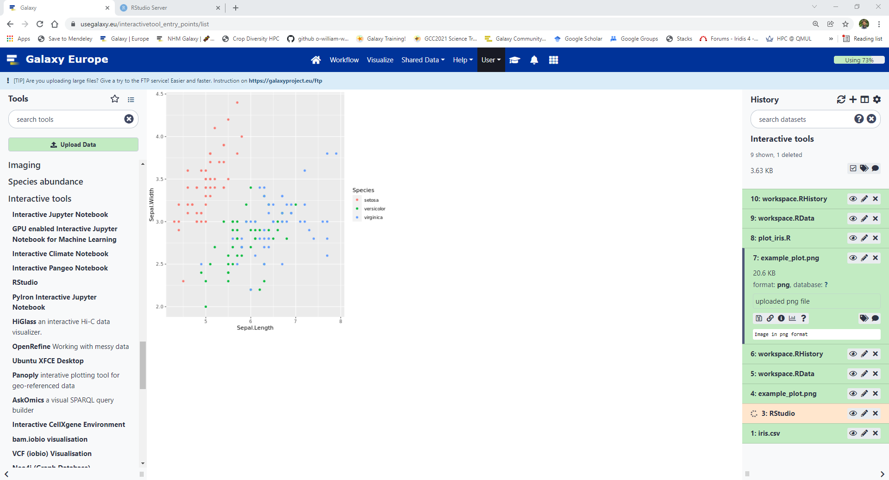

When you are finished in R studio, select "User" from the top menu and "Active Interactive Tools". Tick the box beside R studio and select "Stop"  

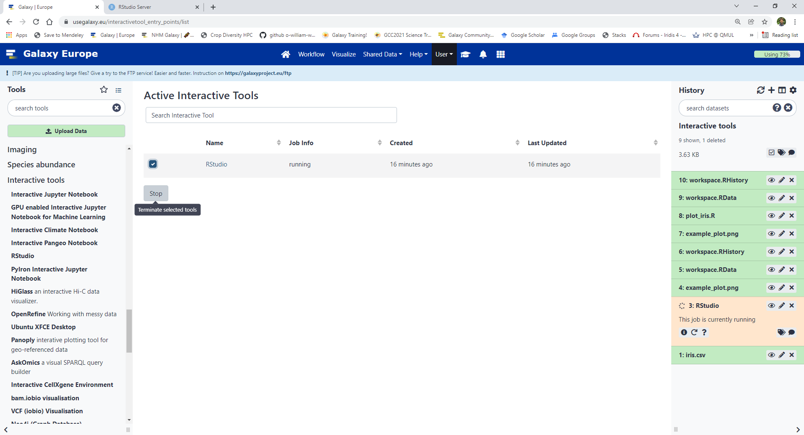

# Jupyter notebook

Select "Interactive Jupyter Notebook" from the tool panel. 

Start a fresh notebook and there is no need to inculde data in the environment. Select "Execute"

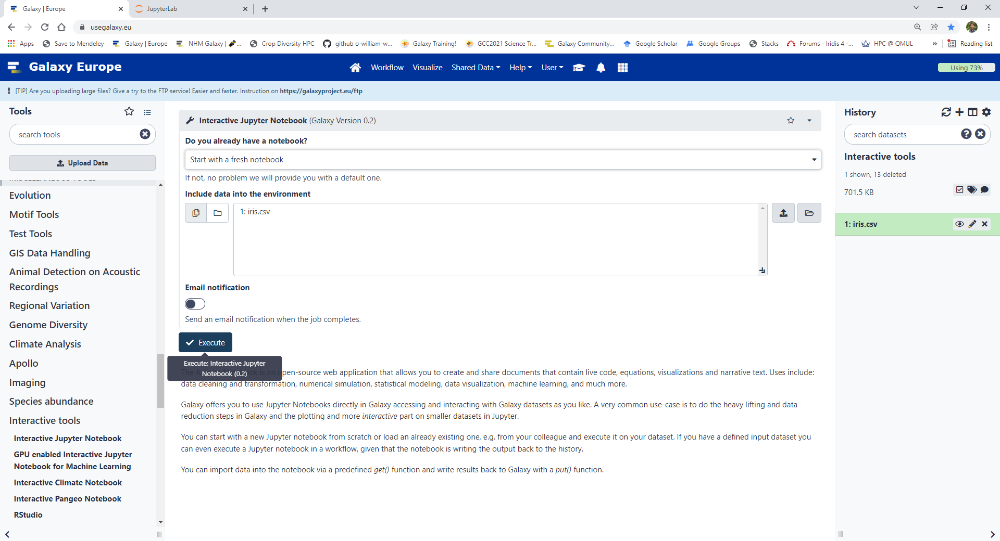


When "Executed Notebook" item in the history panel turns amber/orange, select "User" from the top menu and "Active Interactive Tools"

Select "Jupyter Interactive Tool" under the Name column. 

This will open a new window with Jupyter

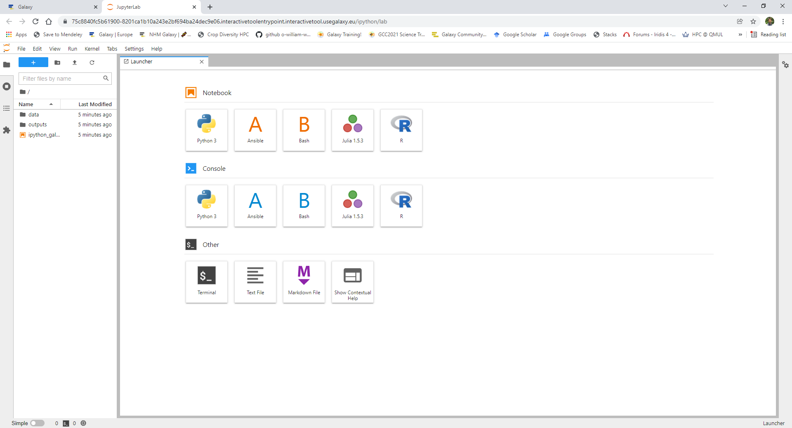

We can now open a new script by selecting "Python 3" under the Notebook heading.

Save the Jupyter_notebook as plot_iris.ipynb and run the following code.

```
import pandas as pd
import seaborn as sns

# read csv from galaxy
dat = pd.read_csv(get(1))

# create plot
p = sns.relplot(data=dat, x="Sepal.Length", y="Sepal.Width", hue="Species")

# save png
p.savefig('example_plot.png')
# push to galaxy
put('example_plot.png')
```

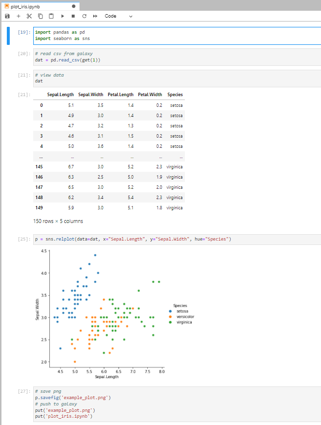

If you go back to Galaxy you can see the outputs in the history panel

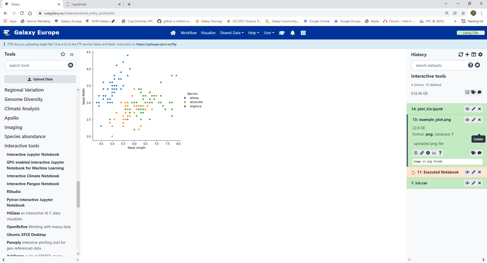

When you are finished in Jupyter, select "User" from the top menu and "Active Interactive Tools". Tick the box beside Jupyter and select "Stop"  
