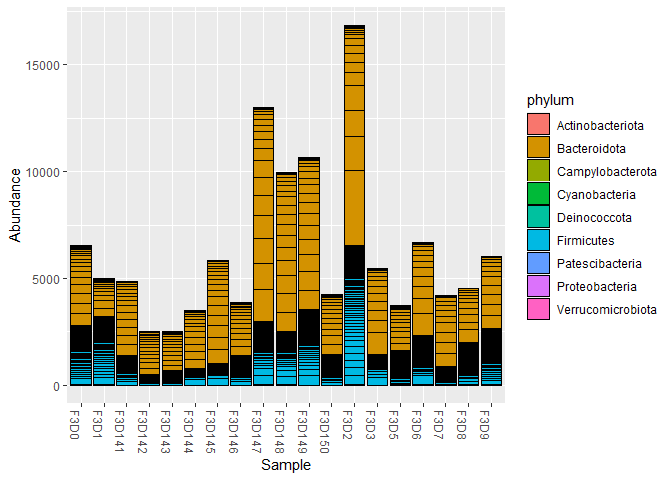
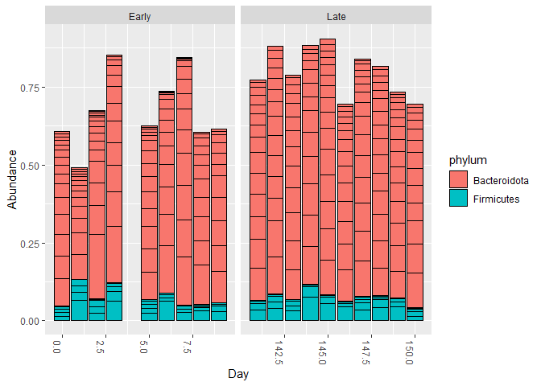
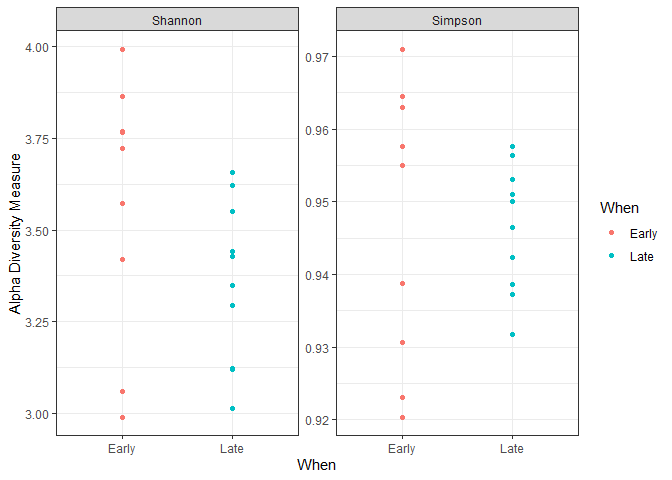
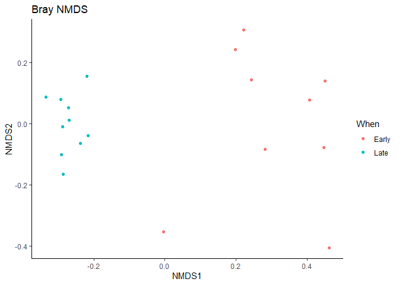

Plot DADA2 galaxy output
================

#### Load libraries

``` r
library(phyloseq)
library(ggplot2)
```

#### Read input data and change format

``` r
# path to files containing galaxy output
# change path if galaxy output is not in the same directory as this script
path <- '.'

# get files in path
files <- list.files(path = path)

# identify galaxy output files
file_tax <- files [ grepl('assignTaxonomy',     files) ]
file_bim <- files [ grepl('RemoveBimeraDenovo', files) ]

# read data
tax <- read.table(file_tax, header = T, sep = '\t', row.names = 1)
bim <- read.table(file_bim, header = T, sep = '\t', row.names = 1)

# store full ASV sequences if we decide to use later
asv <- data.frame(asv_id = paste0('ASV_', 1:nrow(bim)),
                  asv    = rownames(bim))

# abbreviated sequences as rownames
rownames(bim) <- asv$asv_id
rownames(tax) <- asv$asv_id

# check data
head(bim)
```

    ##       F3D0 F3D1 F3D2 F3D3 F3D5 F3D6 F3D7 F3D8 F3D9 F3D141 F3D142 F3D143 F3D144 F3D145 F3D146 F3D147 F3D148 F3D149 F3D150
    ## ASV_1  579  405 3488  988  327 1014  648  272  511    444    289    228    421    645    325   1495    863    883    317
    ## ASV_2  345  353 1587  602  268  674  504  352  423    362    304    176    277    489    230   1215    729    779    229
    ## ASV_3  449  231 1175  465  284  588  438  349  482    345    158    204    302    522    254    913    581    723    399
    ## ASV_4  430   69  472  200  158  404  314  147  206    502    164    231    357    583    388   1089    853    897    471
    ## ASV_5  154  140  338  402  151  476  470  582  596    189    180    130    104    307    179    453    443    417    169
    ## ASV_6  470   41  115   25   23   17   11    0    0    331    181    244    353    476    275   1182    872    637    216

``` r
head(tax)
```

    ##         domain       phylum       class         order         family       genus
    ## ASV_1 Bacteria Bacteroidota Bacteroidia Bacteroidales Muribaculaceae        <NA>
    ## ASV_2 Bacteria Bacteroidota Bacteroidia Bacteroidales Muribaculaceae        <NA>
    ## ASV_3 Bacteria Bacteroidota Bacteroidia Bacteroidales Muribaculaceae        <NA>
    ## ASV_4 Bacteria Bacteroidota Bacteroidia Bacteroidales Muribaculaceae        <NA>
    ## ASV_5 Bacteria Bacteroidota Bacteroidia Bacteroidales Bacteroidaceae Bacteroides
    ## ASV_6 Bacteria Bacteroidota Bacteroidia Bacteroidales Muribaculaceae        <NA>

#### Create sample metadata

``` r
# We can construct a simple sample data.frame from the information encoded in the file names.
# Usually this step would instead involve reading the sample data in from a file. 
samples.out <- colnames(bim)
subject <- sapply(strsplit(samples.out, "D"), `[`, 1)
gender <- substr(subject,1,1)
subject <- substr(subject,2,999)
day <- as.integer(sapply(strsplit(samples.out, "D"), `[`, 2))
samdf <- data.frame(Subject=subject, Gender=gender, Day=day)
samdf$When <- "Early"
samdf$When[samdf$Day>100] <- "Late"
rownames(samdf) <- samples.out
samdf
```

    ##        Subject Gender Day  When
    ## F3D0         3      F   0 Early
    ## F3D1         3      F   1 Early
    ## F3D2         3      F   2 Early
    ## F3D3         3      F   3 Early
    ## F3D5         3      F   5 Early
    ## F3D6         3      F   6 Early
    ## F3D7         3      F   7 Early
    ## F3D8         3      F   8 Early
    ## F3D9         3      F   9 Early
    ## F3D141       3      F 141  Late
    ## F3D142       3      F 142  Late
    ## F3D143       3      F 143  Late
    ## F3D144       3      F 144  Late
    ## F3D145       3      F 145  Late
    ## F3D146       3      F 146  Late
    ## F3D147       3      F 147  Late
    ## F3D148       3      F 148  Late
    ## F3D149       3      F 149  Late
    ## F3D150       3      F 150  Late

#### Read data into phyloseq

``` r
# format data for phyloseq
OTU <- otu_table(as.matrix(bim), taxa_are_rows = T)
TAX <- tax_table(as.matrix(tax))
SAM <- sample_data(samdf)

# construct a phyloseq object
ps <- phyloseq(OTU, SAM, TAX)
ps
```

    ## phyloseq-class experiment-level object
    ## otu_table()   OTU Table:         [ 232 taxa and 19 samples ]
    ## sample_data() Sample Data:       [ 19 samples by 4 sample variables ]
    ## tax_table()   Taxonomy Table:    [ 232 taxa by 6 taxonomic ranks ]

#### Example plots

``` r
# stacked bar plot
plot_bar(ps, fill = "phylum")
```

<!-- -->

``` r
# stacked bar plot of top 20 sequences across early and late
top20 <- names(sort(taxa_sums(ps), decreasing=TRUE))[1:20]
ps.top20 <- transform_sample_counts(ps, function(OTU) OTU/sum(OTU))
ps.top20 <- prune_taxa(top20, ps.top20)
plot_bar(ps.top20, x="Day", fill="phylum") + facet_wrap(~When, scales="free_x")
```

<!-- -->

``` r
# alpha diversity by group
plot_richness(ps, x='When', measures=c("Shannon", "Simpson"), color='When') + theme_bw()
```

    ## Warning in estimate_richness(physeq, split = TRUE, measures = measures): The data you have provided does not have
    ## any singletons. This is highly suspicious. Results of richness
    ## estimates (for example) are probably unreliable, or wrong, if you have already
    ## trimmed low-abundance taxa from the data.
    ## 
    ## We recommended that you find the un-trimmed data and retry.

<!-- -->

``` r
# ordination
# Transform data to proportions as appropriate for Bray-Curtis distances
ps.prop <- transform_sample_counts(ps, function(otu) otu/sum(otu))
ord.nmds.bray <- ordinate(ps.prop, method="NMDS", distance="bray")
```

    ## Run 0 stress 0.08043117 
    ## Run 1 stress 0.08616061 
    ## Run 2 stress 0.09477227 
    ## Run 3 stress 0.08076339 
    ## ... Procrustes: rmse 0.01048601  max resid 0.03226874 
    ## Run 4 stress 0.08076341 
    ## ... Procrustes: rmse 0.01057595  max resid 0.03256229 
    ## Run 5 stress 0.08616061 
    ## Run 6 stress 0.08076338 
    ## ... Procrustes: rmse 0.01052129  max resid 0.03238335 
    ## Run 7 stress 0.08043117 
    ## ... New best solution
    ## ... Procrustes: rmse 3.110648e-06  max resid 6.93556e-06 
    ## ... Similar to previous best
    ## Run 8 stress 0.101063 
    ## Run 9 stress 0.09477173 
    ## Run 10 stress 0.08616061 
    ## Run 11 stress 0.1228545 
    ## Run 12 stress 0.08616061 
    ## Run 13 stress 0.1228545 
    ## Run 14 stress 0.094772 
    ## Run 15 stress 0.1334791 
    ## Run 16 stress 0.08616062 
    ## Run 17 stress 0.0807634 
    ## ... Procrustes: rmse 0.01056616  max resid 0.03252865 
    ## Run 18 stress 0.08616061 
    ## Run 19 stress 0.08616061 
    ## Run 20 stress 0.1212044 
    ## *** Solution reached

``` r
plot_ordination(ps.prop, ord.nmds.bray, color='When', title="Bray NMDS", axes=1:2) + theme_classic()
```

<!-- -->
